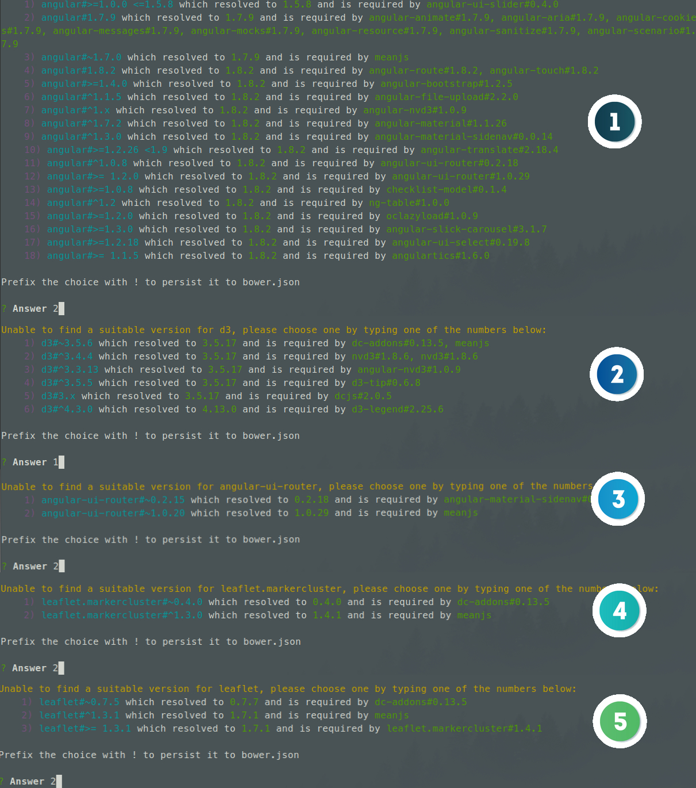
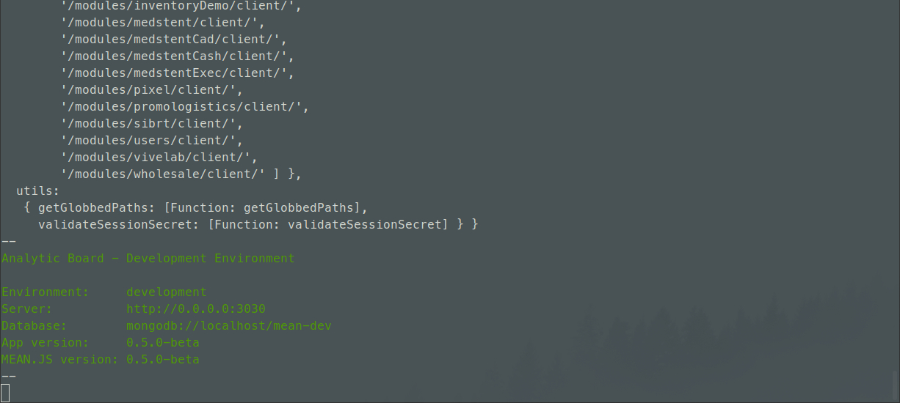
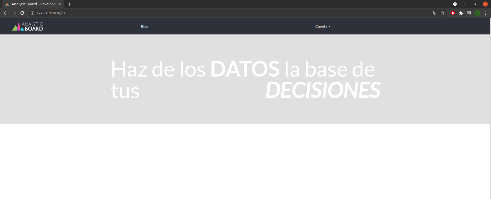
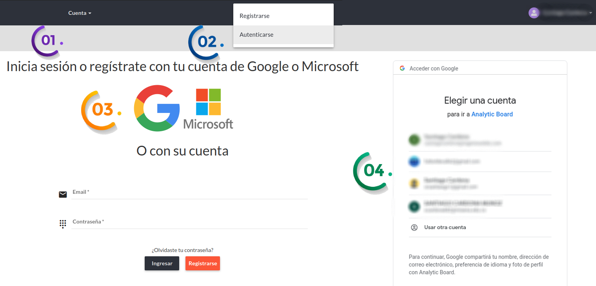
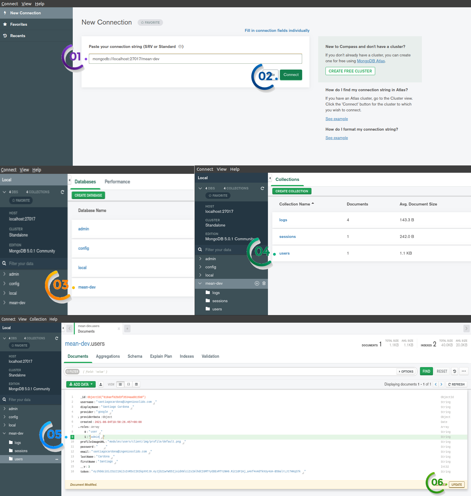
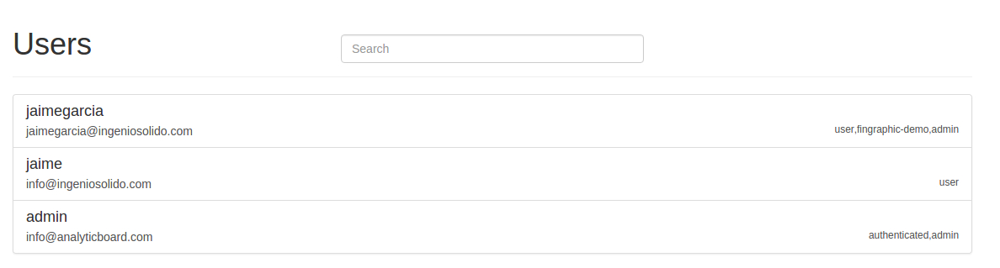
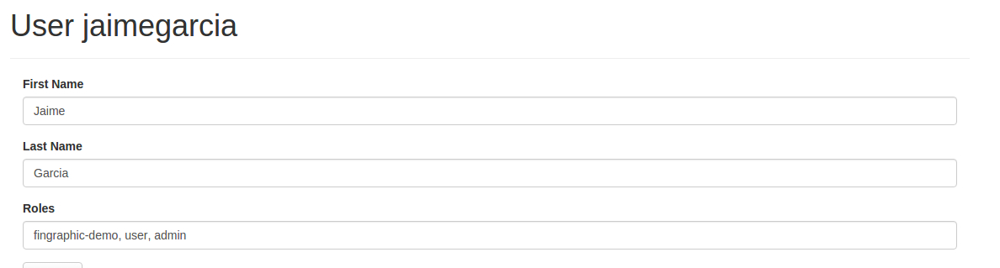

# Instalación AB

Aquí va un breve texto sobre la instalación AB...

## Configuraciones previas

### Instalar Git

Es probable que **Git** ya esté instalado en su servidor **Ubuntu 20.04**. Puede confirmar que este
es el caso colocando el siguiente comando:

```bash
git --version
```

Sin embargo, si no obtuvo el resultado de un número de versión de **Git**, puede instalarlo con el administrador de paquetes predeterminado de **Ubuntu APT**.

Primero, use las herramientas de administración de paquetes de apt para actualizar su índice de paquetes local con el siguiente comando:

```bash
sudo apt update
```

Con la actualización completa, puede instalar **Git** con el siguiente comando:

```bash
sudo apt install git
```

Puede confirmar que ha instalado **Git** correctamente ejecutando el siguiente comando y verificando que recibe el resultado relevante.

```bash
git --version
```

?> En el caso que ninguna de las dos formas anteriormente mencionadas de como instalar **Git** te funcionen
dirígete al siguiente **[blog](https://www.digitalocean.com/community/tutorials/how-to-install-git-on-ubuntu-20-04)** 
de digitalocean donde explican muy bien como instalarlo de las diferentes maneras que hay y soluciones a posibles errores.

### Instalar Node.js

Para instalar **Node.js** utilizaremos **nvm** ( [Repositorio de nvm](https://github.com/nvm-sh/nvm) ) que es un manejardor de versiones de **Node.js**

Para instalar o actualizar **nvm**, debe ejecutar el [script de instalación](https://github.com/nvm-sh/nvm). 
Para hacer eso, puede descargar y ejecutar el script manualmente, o usar el siguiente comando **cURL** o **Wget**

?> En caso de no tener **Curl** solo ejecuta el comando ( **sudo apt install curl** ) 
y en el caso de **Wget** ( **sudo apt install wget** ) una vez instalado recuerda ejecutar **sudo apt update**

```bash
curl -o- https://raw.githubusercontent.com/nvm-sh/nvm/v0.38.0/install.sh
```

```bash
wget -qO- https://raw.githubusercontent.com/nvm-sh/nvm/v0.38.0/install.sh
```

Para verificar que nvm se ha instalado, cierra la consola, la abres nuevamente y colocas el siguiente comando:

```bash
nvm -v
```

Ahora que ya tenemos nvm instalado vamos a instalar la **version 8.9.4** de **Node.js** ya que esta es con la que trabaja **AnalyticBoard**
y para esto colocaremos el siguiente comando:

```bash
nvm install 8.9.4
```

Este comando nos instala tanto **Node.js** como **npm**. Para verificar que se han instalado, simplemente colocaremos los siguientes comandos:

```bash
node --version
```

```bash
npm --version
```

### Instalar Bower

Después de la instalación de **Node.js** y **npm** en su sistema, use el siguiente comando para instalar **Bower**.

```bash
sudo npm install -g bower
```

Para verificar que **Bower** se ha instalado, simplemente colocaremos el siguiente comando:

```bash
bower --version
```

### Instalar MongoDB

> 1. Importe la clave pública utilizada por el sistema de gestión de paquetes.

Importe la clave pública utilizada por el sistema de gestión de paquetes.
Desde una terminal, emita el siguiente comando para importar la clave GPG pública de **MongoDB** desde https://www.mongodb.org/static/pgp/server-5.0.asc

```bash
wget -qO - https://www.mongodb.org/static/pgp/server-5.0.asc | sudo apt-key add -
```

La operación debe responder con un **OK**.

> 2. Cree un archivo de lista para **MongoDB**

La siguiente instrucción es para **Ubuntu 20.04**

```bash
echo "deb [ arch=amd64,arm64 ] https://repo.mongodb.org/apt/ubuntu focal/mongodb-org/5.0 multiverse" | sudo tee /etc/apt/sources.list.d/mongodb-org-5.0.list
```

> 3. Vuelva a cargar la base de datos de paquetes local.

Emita el siguiente comando para volver a cargar la base de datos del paquete local:

```bash
sudo apt-get update
```

> 4. Instale los paquetes de MongoDB.

Puede instalar la última versión estable de **MongoDB** o una versión específica, en nuestro caso
descargaremos la version estable con el siguiente comando:

```bash
sudo apt-get install -y mongodb-org
```

Para verificar que **MongoDB** se ha instalado, simplemente colocaremos el siguiente comando:

```bash
mongod --version
```

?> En caso de errores o un paso de los anteriormente mecionados no te haya funcionado puedes ir a la
[**documentación**](https://docs.mongodb.com/manual/tutorial/install-mongodb-on-ubuntu/) donde se detalla más
la instalación y solución a posibles errores.

Con estos pasos ya tenemos instalado **MongoDB**.

?> En caso de que gustes utilizar **MongoDB** de manera gráfica puedes utilizar [**MongoDB Compass**](https://www.mongodb.com/try/download/compass)

Con estos pasos ya tenemos instalados **Node.js**, **npm**, **Bower** y **MongoDB** con lo cual ya podremos pasar a la instalación.

## Instalación

### Clonar repositorio

Lo primero que haremos es abrir la terminal y posicionarnos en la ruta donde queramos clonar el repositorio y una vez posicionados 
ejecutaremos el siguiente comando:

```bash
git clone https://bitbucket.org/analyticboard/analyticboard.git
```

Una vez clonado nos posicionamos en el proyecto para poder continuar con la instalación de la siguiente manera:

```bash
cd ./analyticboard
```

### Instalar packages

Para instalar los packages simplemente ejecutaremos los siguientes comandos:

```bash
npm install
```

```bash
sudo bower install
```

En el caso de **Bower** nos va a pedir que escojamos ciertas versiones por lo cual vamos a seleccionar las opciones
de la siguente manera:



Una vez ejecutado los dos comandos ya podremos prender el servidor en modo de desarrollo.

### Servidor

Para prender el servidor en modo de desarrollo, simplemente ejecutaremos el siguiente comando:

!> Recuerda tener iniciado el **MongoDB** para poder que funcione la conexión a la base de datos y el servidor pueda iniciar.

```bash
gulp
```

Al ejecutar el comando si todo está correcto el servidor ya debería de estar corriendo en el **127.0.0.1:3030** y en la terminal
tendría que salirte lo siguiente:



Y si nos dirigimos al **127.0.0.1:3030** deberíamos de ver lo siguiente:

!> Muy **importante** y es trabajar todo desde el navegador de **[Google Chrome](https://www.google.com/chrome/?brand=BNSD&gclid=CjwKCAjw9aiIBhA1EiwAJ_GTSlxpdONH6frYPvNobw9WcSzfMl9l8-G6-RHUIFhc_4izjrnKcwES8xoCGUsQAvD_BwE&gclsrc=aw.ds)**



### Colocarse Admin

Lo primero que haremos es autenticarnos con **Google** de la siguiente manera:



Una vez autenticado vamos a asignarle el rol de **Admin** con alguna de las dos siguientes maneras:

<details>
<summary>Desde el código</summary>

!> solo se hace para poder cambiar el rol de admin con un usuario, por lo cual se debe dejar
sin el atributo user cuando se vuelva a subir.

Para colocarnos como **Admin** se deben modificar los siguientes archivos:

> analyticboard/modules/users/client/config/users-admin.client.routes.js

```js
state('admin.users', {
    url: '/users',
    templateUrl: 'modules/users/client/views/admin/list-users.client.view.html',
    controller: 'UserListController',
    controllerAs: 'vm',
    data: {
        pageTitle: 'Users List',
        roles: ['admin','user']//se le adiciona el rol de ‘user’ 
    }
})
.state('admin.user', {
    url: '/users/:userId',
    templateUrl: 'modules/users/client/views/admin/view-user.client.view.html',
    controller: 'UserController',
    controllerAs: 'vm',
    resolve: {
        userResolve: getUser
    },
    data: {
        pageTitle: 'Edit {{ userResolve.displayName }}',
        roles: ['admin','user']//se le adiciona el rol de ‘user’
    }
})
.state('admin.user-edit', {
    url: '/users/:userId/edit',
    templateUrl: 'modules/users/client/views/admin/edit-user.client.view.html',
    controller: 'UserController',
    controllerAs: 'vm',
    resolve: {
        userResolve: getUser
    },
    data: {
        pageTitle: 'Edit User {{ userResolve.displayName }}',
        roles: ['admin', 'user']//se le adiciona el rol de ‘user’
    }
});
```

El siguiente archivo a modificar esta en:

> analyticboard/modules/users/server/policies/admin.server.policy.js

```js
exports.invokeRolesPolicies = function () {
  acl.allow([{
    roles: ['admin','user'],//se le adiciona el rol de ‘user’
    allows: [{
      resources: '/api/users',
      permissions: '*'
    }, {
      resources: '/api/users/:userId',
      permissions: '*'
    }]
  }]);
};
```

</details>

<details>
<summary>Con interfaz grafica de MongoDB</summary>

En este caso se utilizara **MongoDB Compass** el cual es la interfaz gráfica de usuario de **MongoDB**

?> [**Guia**](https://www.how2shout.com/linux/install-mongodb-compass-gui-in-ubuntu-20-04-lts-linux/)
de como instalar **MongoDB Compass** paso a paso.

Para colocarnos como **Admin** seguiremos los siguientes pasos:



Una vez realizado correctamente cualquiera de las dos maneras de colocarse como **Admin** anteriormente mencionadas
ya podremos activar roles para poder entrar a las páginas de los diferentes clientes.

</details>

### Activar roles

Para activar roles lo primero que haremos es dirigirnos a **_http://127.0.0.1:3030/admin/users_** y nos debería aparecer algo tal como:

!> Recuerda tener el usuario como **Admin** de lo contrario no funcionara.



Seleccionamos al usuario al que le queremos asignar un cliente y solo bastara con incluir el nombre 
del cliente como rol de la siguiente manera:

!> De momento debemos poner el rol de cliente de **primero** para que funcione la redirección automática.



Realizando estos pasos correctamente podremos asignar roles a los usuarios sin ningún problema.
