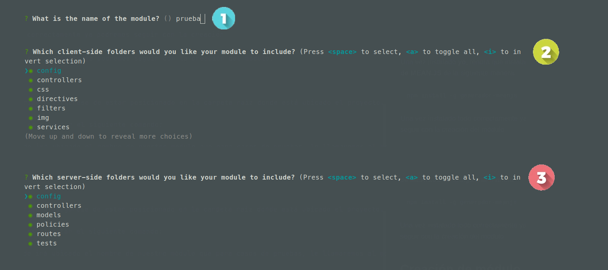
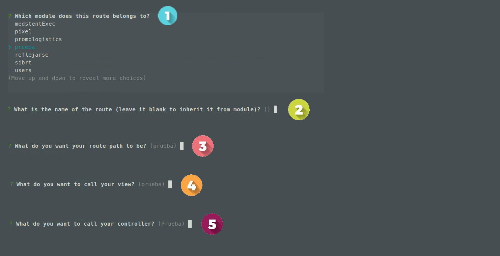
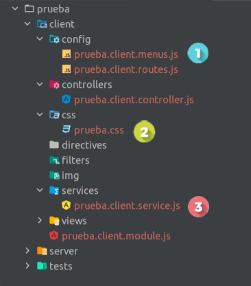
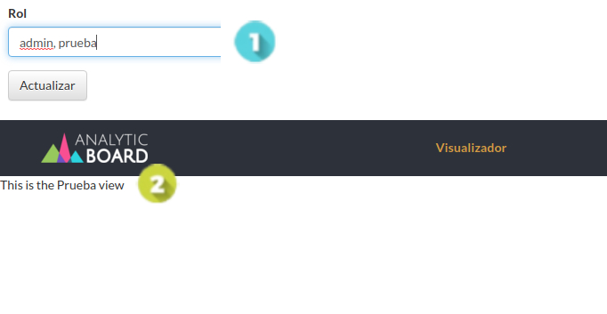

# Creación de nuevo módulo para cliente

Aquí va una breve descripción de módulo para cliente...

## Configuraciones previas

!> Para poder crear un módulo para cliente es **importante** que tengas ya tengas instalado el
ambiente de desarrollo de AnalyticBoard.

Para poder crear un nuevo módulo necesitaremos instalar primero unas librerías que nos ayudaran
con la creación del mismo.

Antes de comenzar, asegúrese de tener instalada la herramienta para andamios **yo** (es posible que ya la haya 
instalado, ya que es parte del conjunto de herramientas Yeoman). Para instalar yo globalmente, necesitará usar **npm**:

?> Es posible que su usuario no tenga los permisos para instalar el paquete globalmente, así que use un superusuario o **sudo**.

```bash
sudo npm install -g yo
```

Una vez instalado **yo**, tendrá que instalar el **generador de MEAN.JS** de la siguiente manera:

```bash
npm install -g generador-meanjs
```

Una vez instalado todo correctamente ya podremos seguir con la creación del módulo.

## Creación de módulo

?> Antes de comenzar primero asegúrese de estar posicionado en la carpeta raiz donde está ubicado el proyecto.

Lo primero que haremos es ejecutar el siguiente comando:

?> **< name >** es donde irá ubicado el nombre de nuestro módulo que para casos de pruebas, le llamaremos al modulo
prueba.

```bash
yo meanjs:mean-module <name>

yo meanjs:mean-module prueba
```

Una vez ejecutado el comando seguiremos los siguientes pasos:

?> En el segundo y tercer paso presionaremos la letra **a** para seleccionar todas las opciones.



?> En el primer punto elegiremos el nombre del módulo que hemos estado creando hasta el momento,
en este caso seria prueba y en los siguientes pasos solo daremos enter.



Una vez creado todo correctamente, vamos a crear los siguientes archivos:

?> En vez de **prueba** colocaremos el nombre de como hayamos nombrado nuestro módulo.



Una vez creado los archivos anteriormente mencionados, procederemos a editar y agregar unas líneas de código
en los siguientes archivos:

Primero nos posicionaremos en el archivo **< name >.client.menus.js** y agregaremos las siguientes líneas de código:

```js
(function () {
    'use strict';

    angular
        .module('<name>')
        .run(menuConfig);

    menuConfig.$inject = ['menuService'];

    function menuConfig(menuService) {
        menuService.addMenuItem('topbar', {
            title: '<name>',
            state: '<name>',
            roles: ['<name>']
        });
    }
}());
```

Como siguiente paso nos vamos a posicionar en el archivo **< name >.client.routes.js** en el cual editares y
agregaremos las siguientes líneas de código:

```js
(function () {
    'use strict';
    
    angular
        .module('core')
        .config(routeConfig);

    routeConfig.$inject = ['$stateProvider'];

    function routeConfig($stateProvider) {
        $stateProvider
            .state('<name>', {
                templateUrl: 'modules/<name>/client/views/<name>.client.view.html',
                controller: '<name>Controller',
                controllerAs: 'vm',
                data: {
                    roles: ['<name>'],
                    pageTitle: '<name>'
                },
                resolve: {
                    loadMyCtrl: ['$ocLazyLoad', function($ocLazyLoad) {
                        // you can lazy load files for an existing module
                        return $ocLazyLoad.load(['modules/<name>/client/css/<name>.css',
                            'modules/<name>/client/services/<name>.client.service.js',
                            'modules/<name>/client/controllers/<name>.client.controller.js']);
                    }]
                }
            });
    }
})();
```

Como siguiente paso nos posicionaremos en el archivo **< name >.client.controller.js** y simplemente
cambiaremos la siguiente línea de código: 

```js
module('core')
```

Como siguiente paso nos posicionaremos en el archivo **/modules/core/client/controllers/header.client.controller.js**
y agregaremos el nombre de nuestro módulo en la siguiente línea de código:

?> Es muy posible que en el array ya hallan nombres de otros módulos, simplemente agrégalo al array y con eso bastará. 

```js
$rootScope.visualizador = ['<name>']
```

Y como último paso nos posicionaremos en el archivo **/modules/users/server/models/user.server.model.js** y
agregaremos el nombre de nuestro módulo en la siguiente línea de código:

?> Es muy posible que en el array ya hallan nombres de otros roles, simplemente agrégalo al array y con eso bastará.

```js
roles: {
    type: [{
        type: String,
        enum: ['<name>']
    }],
default: ['user'],
required: 'Please provide at least one role'
}
```

Con estos pasos ya simplemente tendríamos que **asignarle a un usuario el rol < name >** y probar, lo cual 
veremos algo tal como:



Con estos pasos ya tendremos nuestro módulo preparado y listo para desarrollar.
